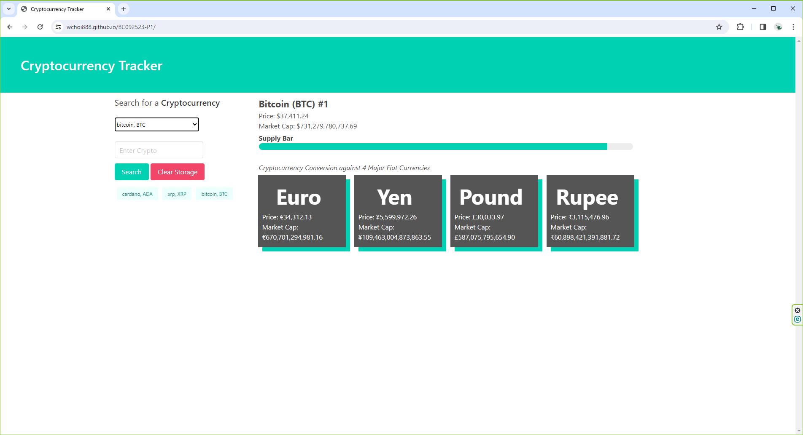

# Crypocurrency Tracker

## Overview

The Cryptocurrency Tracker App is an intuitive web application designed to empower users with seamless real-time conversion of cryptocurrency values to five popular fiat currencies (US Dollar, British Pound, Japanese Yen, Indian Rupee, and Euro) along with market cap information. This client-side application is crafted using HTML, JavaScript, and styled with the Bulma framework, ensuring a modern and responsive design. The app efficiently utilizes two server-side APIs to fetch up-to-date conversion rates, delivering accurate and timely information to users. Additionally, the app incorporates a local storage feature to store previous searches, enabling users to quickly retrieve and review their past conversion queries.

## Installation

N/A

## Usage

To make the most of the Cryptocurrency Tracker App, you have two convenient options for accessing real-time conversion rates and additional information. You can utilize the user-friendly drop-down menu, allowing you to effortlessly select the cryptocurrency of your choice. Alternatively, you can opt for manual input by providing the name or symbol of the cryptocurrency you wish to convert. The app will then automatically retrieve real-time conversion rates for the selected cryptocurrency against USD, JPY, EUR, GBP, and INR. Additionally, the conversion result will display the cryptocurrency's current market cap size, offering users valuable insights into its overall market standing. Whether you prefer the simplicity of the drop-down menu or the flexibility of manual input, the app ensures a swift and informative conversion experience, catering to both novice and experienced users alike.

## Credits

### API Providers

We appreciate the invaluable services provided by the following API providers, which have greatly enriched the functionality of our app:

- [CoinCap.io](https://api.coincap.io/v2/assets) - For delivering real-time cryptocurrency data and market cap information.
- [ExchangeRate-API](https://open.er-api.com/v6/latest/USD) - For providing up-to-date fiat currency conversion rates against the US Dollar.

### Team Members

We would like to extend our gratitude to the dedicated team members who contributed to the development of the Cryptocurrency Tracker App:

- Kevin Pierce
- Blake Yaccino
- Giovanni Strangio
- Wing Choi

## License

Please refer to the LICENSE in the repo.

## Webpage URL

https://wchoi888.github.io/BC092523-P1/

## Screenshot

